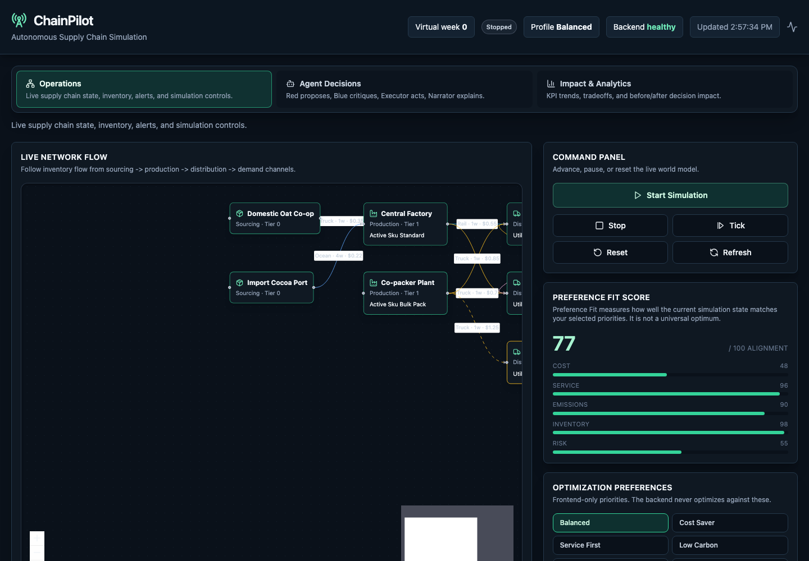
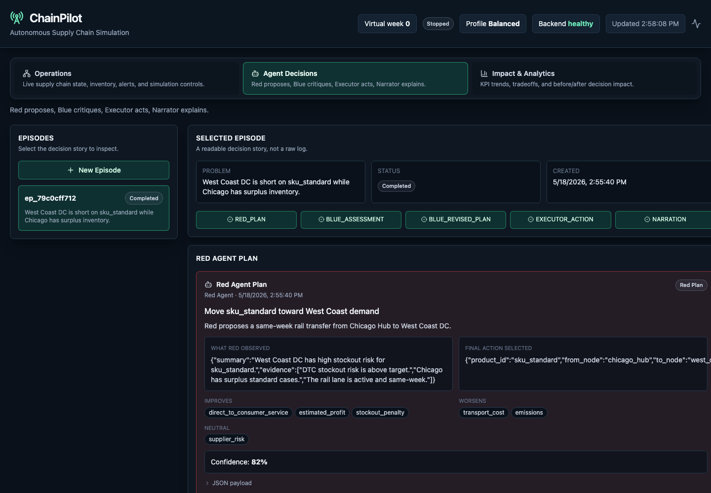
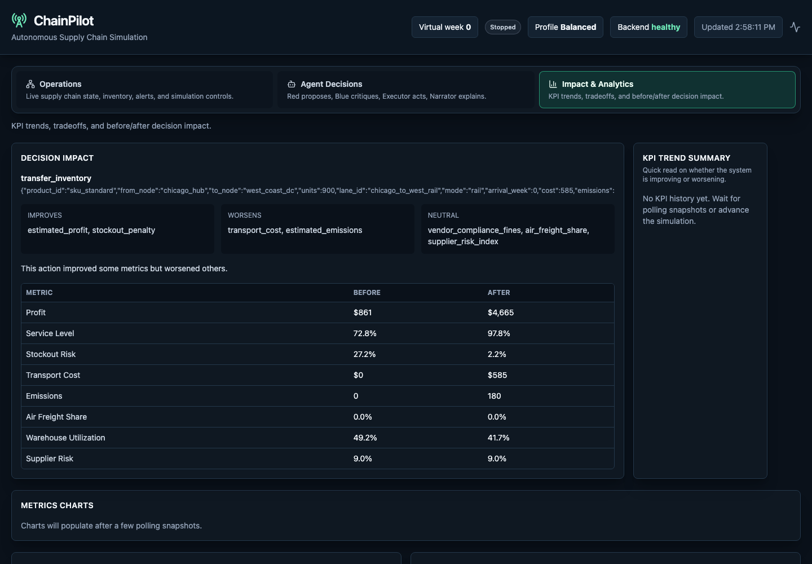
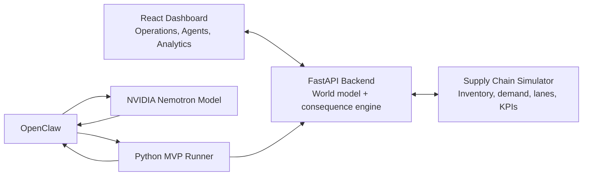

# ChainPilot

**Autonomous supply-chain simulation for auditable agent decisions.**

ChainPilot is a hackathon prototype that pairs NVIDIA Nemotron-powered agent reasoning with a FastAPI supply-chain simulator. The simulator is the world model and consequence engine, not an optimizer: agents decide what action to test, and ChainPilot validates the action, mutates the simulated world, and measures the business impact.

The result is an agentic workflow that is easier to trust: Red proposes, Blue critiques and revises, Executor acts, and the dashboard explains what improved, what worsened, and why.



## Why It Is Different

Most agent demos ask the model to produce an answer directly. ChainPilot separates the responsibilities:

- **Agents reason externally** using NVIDIA Nemotron through OpenClaw.
- **The simulator owns reality**: inventory, lanes, demand, costs, emissions, service levels, and profit.
- **Execution is constrained** to explicit backend action endpoints.
- **Every decision is auditable** as an episode timeline with before/after KPIs.

This makes the system feel less like a chatbot and more like an agentic control loop for operational decision-making.

## Product Views

### Operations View

Live command-center view of the simulated supply chain:

- network graph
- simulation controls
- optimization preference profile
- KPI strip
- inventory, shipments, alerts, and activity history


### Agent Decisions View

Human-readable agent episode story:

- Red Agent plan
- Blue Agent assessment and final plan
- Executor action and execution result
- KPI evaluation
- plain-English narration



### Impact & Analytics View

Business impact view for judges and operators:

- latest decision impact
- before/after KPI comparison
- profit, service, cost, emissions, and air freight trends
- recent actions and alerts



## Architecture



## Agent Workflow

Normal episode event flow:

```text
RED_PLAN
-> BLUE_ASSESSMENT
-> BLUE_REVISED_PLAN
-> EXECUTOR_ACTION
-> EXECUTION_RESULT
-> KPI_EVALUATION
-> NARRATION
```

For the MVP, `agents/run_mvp_episode.py` uses one OpenClaw/Nemotron call to produce a compact Red/Blue decision package. Python then posts the individual events, executes Blue's final action through the backend, records KPI impact, and completes the episode.

This keeps the live demo stable while preserving the core agent story.

## Simulation Model

The backend simulates a small enterprise supply chain:

- sourcing nodes: `domestic_oat_co_op`, `import_cocoa_port`
- production nodes: `central_factory`, `co_packer_plant`
- distribution nodes: `chicago_hub`, `west_coast_dc`, `overflow_3pl`
- demand channels: `big_box_retail`, `direct_to_consumer`
- products: `sku_standard`, `sku_bulk_pack`

The simulator tracks:

- inventory by product, node, and age bucket
- demand by channel and product
- lane capacity, transit time, mode, cost, emissions, and reliability
- in-transit shipments
- stockout risk and service level
- estimated profit, transport cost, emissions, supplier risk, and warehouse utilization

The current demo state intentionally creates a clear decision opportunity: Chicago has enough `sku_standard`, while West Coast DC is short for direct-to-consumer demand. A same-week transfer from Chicago to West Coast improves service and profit while accepting modest transport cost and emissions.

## Repository Structure

```text
.
├── agents/      # Python OpenClaw/Nemotron runners and agent prompts
├── backend/     # FastAPI simulation backend
├── docs/images/ # Product screenshots used by this README
└── frontend/    # Vite + React + TypeScript dashboard
```

## Local Setup

### 1. Backend

```bash
cd backend
python3 -m venv .venv
source .venv/bin/activate
pip install -r requirements.txt
uvicorn main:app --host 127.0.0.1 --port 8000 --reload
```

Backend docs:

```text
http://127.0.0.1:8000/docs
```

### 2. Frontend

```bash
cd frontend
npm install
cp .env.example .env
npm run dev -- --host 0.0.0.0 --port 5173
```

Open:

```text
http://localhost:5173
```

The frontend reads `VITE_API_BASE_URL` and defaults to `http://localhost:8000`.

### 3. One-Shot MVP Agent Run

In a Brev/OpenClaw environment with OpenClaw configured:

```bash
cd agents
export BACKEND_URL=https://backend-supply-utfs.onrender.com

python3 run_mvp_episode.py \
  --backend https://backend-supply-utfs.onrender.com \
  --openclaw-agent main \
  --openclaw-timeout 900 \
  --reset-first
```

For local backend testing:

```bash
cd agents
python3 run_mvp_episode.py \
  --backend http://127.0.0.1:8000 \
  --openclaw-agent main \
  --openclaw-timeout 900 \
  --reset-first
```

## Core API Endpoints

State and telemetry:

- `GET /state`
- `GET /graph`
- `GET /kpis`
- `GET /actions/history`
- `GET /events/history`
- `GET /alerts/history`
- `POST /tick`
- `POST /reset`

Simulation endpoints are non-mutating:

- `POST /simulate/transfer-inventory`
- `POST /simulate/update-production-schedule`
- `POST /simulate/update-supplier-allocation`
- `POST /simulate/update-reorder-point`

Execution endpoints mutate the world:

- `POST /execute/transfer-inventory`
- `POST /execute/update-production-schedule`
- `POST /execute/update-lane`
- `POST /execute/update-supplier-allocation`
- `POST /execute/update-reorder-point`

Agent episode endpoints:

- `POST /api/agent/episodes`
- `GET /api/agent/episodes`
- `GET /api/agent/episodes/{episode_id}/context`
- `POST /api/agent/events`
- `GET /api/agent/episodes/{episode_id}/timeline`
- `GET /api/agent/episodes/{episode_id}/latest-final-action`

## NVIDIA Usage

ChainPilot uses NVIDIA Nemotron models through OpenClaw for the agent reasoning layer:

- Red Agent identifies the operational issue and proposes a plan.
- Blue Agent critiques the plan, checks risks, and produces the final executable action.
- Executor-Narrator records the execution story and explains the KPI impact.

The backend deliberately does not expose `/optimize` or `/best-action`. The model is responsible for proposing and explaining decisions; the simulator is responsible for validating consequences.

## Demo Talking Points

- ChainPilot is not an optimizer hidden behind an API.
- It is an auditable agentic decision loop.
- The simulator creates a trusted reality layer.
- The agents produce decisions and explanations.
- The dashboard shows the operational state, reasoning story, and business impact.

## Build Checks

Backend:

```bash
python3 -m py_compile backend/main.py backend/agent_orchestration/router.py backend/simulation/state.py
```

Frontend:

```bash
cd frontend
npm run build
```
